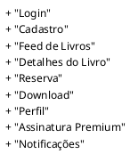
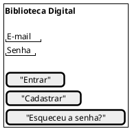
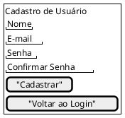
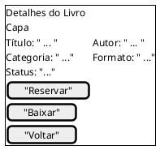
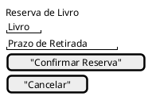
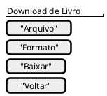
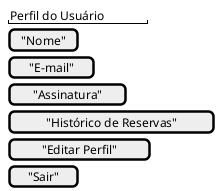
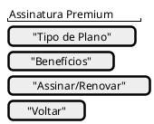
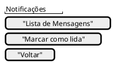

# Protótipo de Baixa Fidelidade - Biblioteca Digital

## Introdução

Este documento apresenta o protótipo de baixa fidelidade para o sistema de biblioteca de livros digitais, auxiliando na definição da interface, funcionalidades e fluxo de navegação para validação inicial com usuários e equipe de desenvolvimento.

## Metodologia

O protótipo foi elaborado com base nos requisitos levantados e nos casos de uso principais, utilizando ferramentas como papel, lápis e software de prototipação simples. O objetivo é validar a experiência do usuário, fluxo de telas e principais funcionalidades antes da implementação.

## Telas do Protótipo

- Tela de Login
- Tela de Cadastro
- Tela de Busca de Livros
- Tela de Detalhes do Livro
- Tela de Reserva de Livro
- Tela de Download
- Tela de Perfil do Usuário
- Tela de Assinatura Premium
- Tela de Notificações

## Diagrama de Navegação (Salt/PlantUML)



## Tela de Login



## Tela de Cadastro



## Tela de Feed de Livros

```
@startsalt
{+
  {
    " Autor, Título,... " | [ Barra de Busca ]
    {+
    () Feed de Livros | [Detalhes]  
    () Feed de Livros
    .
    () Feed de Livros
    }

    [ "Perfil" ]
    [ "Assinatura" ]
    [ "Notificações" ]
  }
}
@endsalt
```

## Tela de Detalhes do Livro




## Tela de Reserva



## Tela de Download



## Tela de Perfil do Usuário



## Tela de Assinatura Premium



## Tela de Notificações



## Conclusão

O protótipo de baixa fidelidade permite validar o fluxo principal do sistema, identificar melhorias na interface e garantir que os requisitos essenciais estejam contemplados antes do desenvolvimento detalhado.

## Referências

- Documento de requisitos da biblioteca digital
- Ferramentas de prototipação (ex: Figma, papel e lápis)
- Material Design Color Tool
