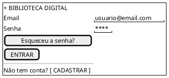
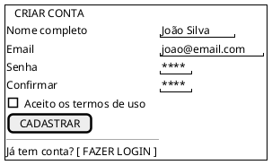
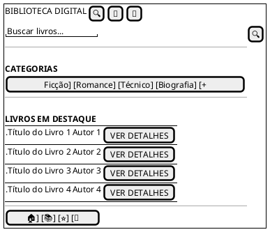
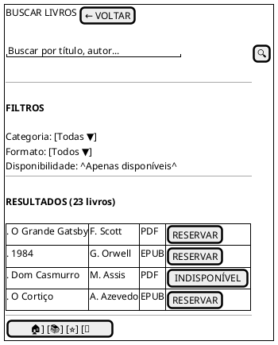
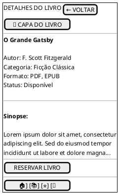
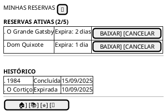
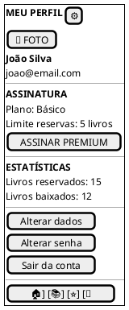
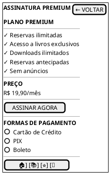
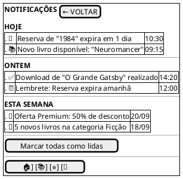

## Introdução

A construção do protótipo de baixa fidelidade auxilia a equipe de desenvolvimento a visualizar a estrutura e fluxo das interfaces do usuário de forma simplificada, permitindo identificar problemas de usabilidade precocemente, definir a arquitetura da informação e fornecer uma base sólida para o desenvolvimento das funcionalidades do sistema de biblioteca digital.

## Metodologia

Para a criação dos protótipos de baixa fidelidade foi utilizada a ferramenta PlantUML com a extensão Salt, que permite criar wireframes de forma rápida e clara, focando na estrutura e organização dos elementos sem se preocupar com aspectos visuais detalhados. Os protótipos foram desenvolvidos com base nos requisitos funcionais levantados e nos casos de uso definidos para o sistema.

## Protótipos de Baixa Fidelidade

### Versão 1.0

### Tela de Login

### Tela de Cadastro

### Tela Principal - Catálogo

### Tela de Busca

### Tela de Detalhes do Livro

### Tela de Minhas Reservas

### Tela de Perfil do Usuário

### Tela de Assinatura Premium

### Tela de Notificações

## Fluxo de Navegação

O sistema foi projetado com uma navegação intuitiva, onde o usuário pode:

1. **Login/Cadastro**: Acesso inicial ao sistema
2. **Tela Principal**: Ponto central com destaque para livros e acesso às funcionalidades
3. **Busca**: Ferramenta robusta de localização de livros com filtros
4. **Detalhes**: Visualização completa das informações do livro
5. **Reservas**: Gerenciamento das reservas ativas e histórico
6. **Perfil**: Configurações pessoais e informações da assinatura
7. **Premium**: Upgrade para funcionalidades avançadas
8. **Notificações**: Comunicação sobre atividades e lembretes

## Conclusão

A partir da elaboração dos protótipos de baixa fidelidade foi possível definir a estrutura básica das interfaces, o fluxo de navegação entre as telas e a organização hierárquica das informações. Os wireframes serviram como base para validar os requisitos funcionais e identificar possíveis melhorias na experiência do usuário antes do desenvolvimento das interfaces de alta fidelidade.

## Referências

> PlantUML Salt. Disponível em: https://plantuml.com/salt

> PREECE, J.; ROGERS, Y.; SHARP, H. Design de interação: além da interação homem-computador. Porto Alegre: Bookman, 2005.

> GARRETT, Jesse James. The elements of user experience: user-centered design for the web and beyond. 2ª ed. Berkeley: New Riders, 2010.

## Autor(es)

| Data     | Versão | Descrição                            | Autor(es)                                                                            |
| -------- | ------- | -------------------------------------- | ------------------------------------------------------------------------------------ |
| 23/09/25 | 1.0     | Criação do documento                 |                                                  |
| 23/09/25 | 1.1     | Adicionados protótipos PlantUML Salt    |                                                  |
| 23/09/25 | 1.2     | Adicionado fluxo de navegação e conclusão   |                                                   |