## Introdução

A construção do protótipo de baixa fidelidade auxilia a equipe de desenvolvimento a visualizar a estrutura e fluxo das interfaces do usuário de forma simplificada, permitindo identificar problemas de usabilidade precocemente, definir a arquitetura da informação e fornecer uma base sólida para o desenvolvimento das funcionalidades do sistema de biblioteca digital.

## Metodologia

Para a criação dos protótipos de baixa fidelidade foi utilizada a ferramenta PlantUML com a extensão Salt, que permite criar wireframes de forma rápida e clara, focando na estrutura e organização dos elementos sem se preocupar com aspectos visuais detalhados. Os protótipos foram desenvolvidos com base nos requisitos funcionais levantados e nos casos de uso definidos para o sistema.

## Protótipos de Baixa Fidelidade

### Versão 1.0

### Tela de Login

```plantuml
@startsalt
{+
  {
     + BIBLIOTECA DIGITAL
  }
  {
    Email     | "usuario@email.com"
    Senha     | "****"           
    [  Esqueceu a senha?  ]
    [ ENTRAR ]
    --
    Não tem conta? [ CADASTRAR ]
  }
}
@endsalt
```

### Tela de Cadastro

### Tela Principal - Catálogo

```plantuml
@startsalt
{+
  {
    BIBLIOTECA DIGITAL | [🔍] | [👤] | [🔔]
  }
  {
    "Buscar livros..."  | [🔍]
    --
    .
    **CATEGORIAS**
    [Ficção] [Romance] [Técnico] [Biografia] [+]
    --
    .
    **LIVROS EM DESTAQUE**
    {-
      .Título do Livro 1     | Autor 1     | [VER DETALHES]
      .Título do Livro 2     | Autor 2     | [VER DETALHES] 
      .Título do Livro 3     | Autor 3     | [VER DETALHES]
      .Título do Livro 4     | Autor 4     | [VER DETALHES]
    }
    --
    [🏠] [📚] [⭐] [👤]
  }
}
@endsalt
```

### Tela de Busca

```plantuml
@startsalt
{+
  {
    BUSCAR LIVROS | [← VOLTAR]
  }
  .
  {
    "Buscar por título, autor..." | [🔍]
    .
    --
    .
    **FILTROS**
    .
    Categoria: [Todas ▼]
    Formato: [Todos ▼]
    Disponibilidade: ^Apenas disponíveis^
    --
    .
    **RESULTADOS (23 livros)**
    .
    {#
      . O Grande Gatsby        | F. Scott    | PDF  | [RESERVAR]
      . 1984                   | G. Orwell   | EPUB | [RESERVAR]
      . Dom Casmurro           | M. Assis    | PDF  | [INDISPONÍVEL]
      . O Cortiço              | A. Azevedo  | EPUB | [RESERVAR]
    }
    --
    [🏠] [📚] [⭐] [👤]
  }
}
@endsalt
```

### Tela de Detalhes do Livro

```plantuml
@startsalt
{+
  {
    DETALHES DO LIVRO | [← VOLTAR]
  }
  {
    [📖 CAPA DO LIVRO]
    --
    **O Grande Gatsby**
    .
    Autor: F. Scott Fitzgerald
    Categoria: Ficção Clássica
    Formato: PDF, EPUB
    Status: Disponível
    .
    --
    .
    **Sinopse:**
    .
    Lorem ipsum dolor sit amet, consectetur
    adipiscing elit. Sed do eiusmod tempor
    incididunt ut labore et dolore magna...
    --
    [ RESERVAR LIVRO ]
    --
    [🏠] [📚] [⭐] [👤]
  }
}
@endsalt
```

### Tela de Minhas Reservas

```plantuml
@startsalt
{
  {
    MINHAS RESERVAS | [🔔]
  }
  {
    **RESERVAS ATIVAS (2/5)**
    {#
      . O Grande Gatsby    | Expira: 2 dias | [BAIXAR] [CANCELAR]
      . Dom Quixote        | Expira: 1 dia  | [BAIXAR] [CANCELAR]
    }
    --
    .
    **HISTÓRICO**
    {#
      . 1984              | Concluída | 15/09/2025
      . O Cortiço         | Expirada  | 10/09/2025
    }
    --
    [🏠] [📚] [⭐] [👤]
  }
}
@endsalt
```

### Tela de Perfil do Usuário

```plantuml
@startsalt
{+
  {
    **MEU PERFIL** | [⚙️]
  }
  {
    [👤 FOTO]
    **João Silva**
    joao@email.com
    --
    **ASSINATURA**
    Plano: Básico
    Limite reservas: 5 livros
    [ ASSINAR PREMIUM ]
    --
    **ESTATÍSTICAS**
    Livros reservados: 15
    Livros baixados: 12
    --
    [Alterar dados]
    [Alterar senha]
    [Sair da conta]
    --
    [🏠] [📚] [⭐] [👤]
  }
}
@endsalt
```

### Tela de Assinatura Premium

```plantuml
@startsalt
{+
  {
    **ASSINATURA PREMIUM** | [← VOLTAR]
  }
  {
    **PLANO PREMIUM**
    --
    ✓ Reservas ilimitadas
    ✓ Acesso a livros exclusivos  
    ✓ Downloads ilimitados
    ✓ Reservas antecipadas
    ✓ Sem anúncios
    --
    **PREÇO**
    R$ 19,90/mês
    --
    [ ASSINAR AGORA ]
    --
    **FORMAS DE PAGAMENTO**
    ()Cartão de Crédito
    ()PIX
    ()Boleto
    --
    [🏠] [📚] [⭐] [👤]
  }
}
@endsalt
```

### Tela de Notificações

```plantuml
@startsalt
{+
  {
    **NOTIFICAÇÕES** | [← VOLTAR]
  }
  {
    **HOJE**
    {#
      . 🔔  | Reserva de "1984" expira em 1 dia     | 10:30
      . 📚  | Novo livro disponível: "Neuromancer" | 09:15
    }
    --
    **ONTEM**
    {#
      . ✅ | Download de "O Grande Gatsby" realizado | 14:20
      . ⏰ | Lembrete: Reserva expira amanhã        | 12:00
    }
    --
    **ESTA SEMANA**
    {#
      . 💎 | Oferta Premium: 50% de desconto | 20/09
      . 📖 | 5 novos livros na categoria Ficção | 18/09
    }
    --
    [Marcar todas como lidas]
    --
    [🏠] [📚] [⭐] [👤]
  }
}
@endsalt
```

## Fluxo de Navegação

O sistema foi projetado com uma navegação intuitiva, onde o usuário pode:

1. **Login/Cadastro**: Acesso inicial ao sistema
2. **Tela Principal**: Ponto central com destaque para livros e acesso às funcionalidades
3. **Busca**: Ferramenta robusta de localização de livros com filtros
4. **Detalhes**: Visualização completa das informações do livro
5. **Reservas**: Gerenciamento das reservas ativas e histórico
6. **Perfil**: Configurações pessoais e informações da assinatura
7. **Premium**: Upgrade para funcionalidades avançadas
8. **Notificações**: Comunicação sobre atividades e lembretes

## Conclusão

A partir da elaboração dos protótipos de baixa fidelidade foi possível definir a estrutura básica das interfaces, o fluxo de navegação entre as telas e a organização hierárquica das informações. Os wireframes serviram como base para validar os requisitos funcionais e identificar possíveis melhorias na experiência do usuário antes do desenvolvimento das interfaces de alta fidelidade.

## Referências

> PlantUML Salt. Disponível em: https://plantuml.com/salt

> PREECE, J.; ROGERS, Y.; SHARP, H. Design de interação: além da interação homem-computador. Porto Alegre: Bookman, 2005.

> GARRETT, Jesse James. The elements of user experience: user-centered design for the web and beyond. 2ª ed. Berkeley: New Riders, 2010.

## Autor(es)

| Data     | Versão | Descrição                            | Autor(es)                                                                            |
| -------- | ------- | -------------------------------------- | ------------------------------------------------------------------------------------ |
| 23/09/25 | 1.0     | Criação do documento                 |                                                  |
| 23/09/25 | 1.1     | Adicionados protótipos PlantUML Salt    |                                                  |
| 23/09/25 | 1.2     | Adicionado fluxo de navegação e conclusão   |                                                   |